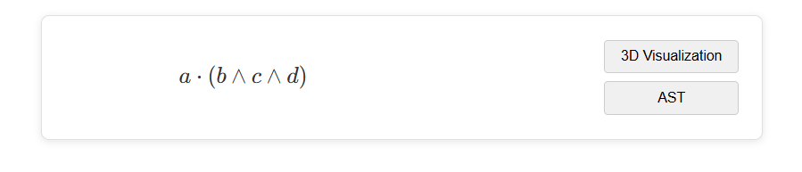
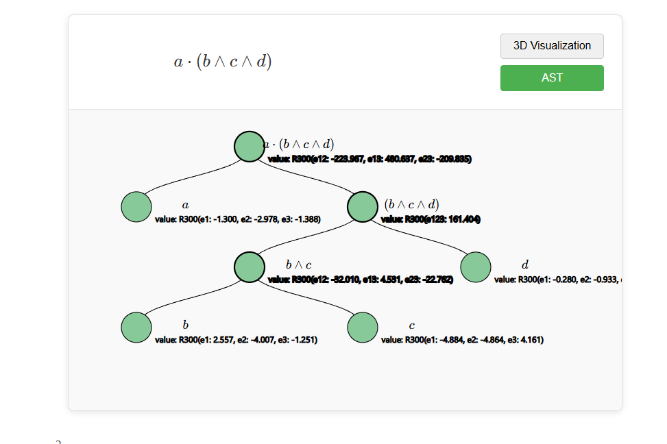
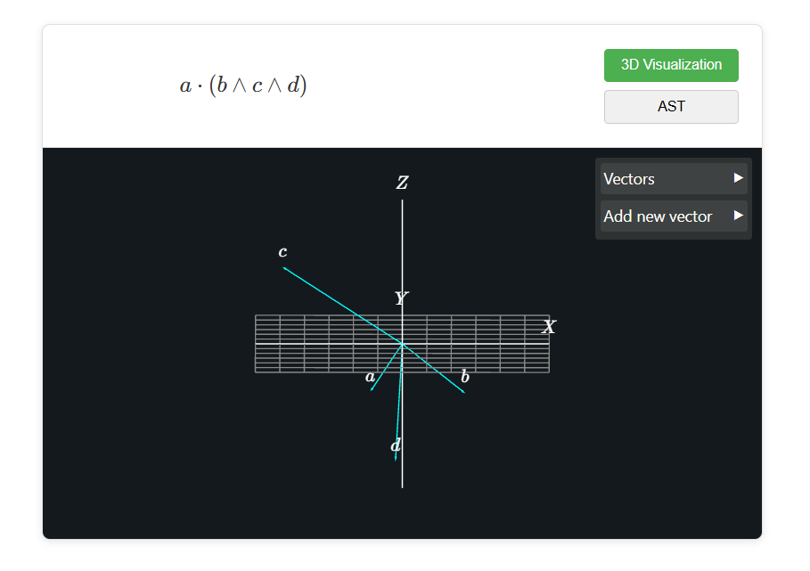

# Concept for Interactive Textbooks
A while back I started reading [New Foundations for Classical Mechanics](https://www.amazon.com/Foundations-Classical-Mechanics-Fundamental-Theories/dp/0792353021) by David Hestenes. In short its an attempt to rewrite classical physics in the language of [Geometric Algebra](https://en.wikipedia.org/wiki/Geometric_algebra) . When I came across these equations:
![[resources/ga_equation.png]]
I wanted to see these equations geometrically and see how the transformations change the vectors.
This became a demo to imagine how it would look to make our current textbooks interactive.

So from this:
```latexvis
a \cdot (b \wedge c \wedge d)
```

you get an interactive component 
where you can see the AST of the equation 
and you can click on the nodes to place them in the 3D space 

This is supposedly one tool in many that can be created to make textbooks interactive and bring a little life to them.

### Current State
Currently this is not very usable and there is a lot to be done to actually make this at all useful.
1. support more types of equations (in the latex parser)
2. fix bivector decomposition
3. add option to take an image of the page and turn it into a markdown page
4. add feature to manipulate vectors
5. lots more...

But hopefully it gets the point accross a little, had fun vibe coding this project :)
